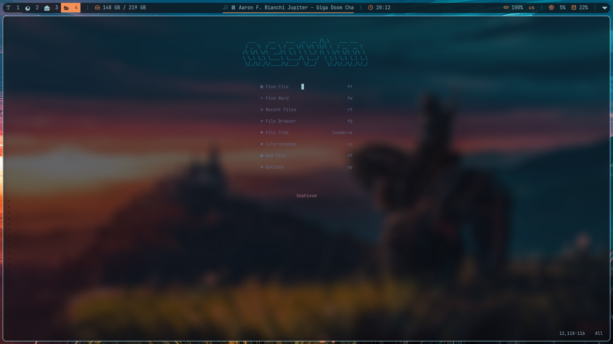
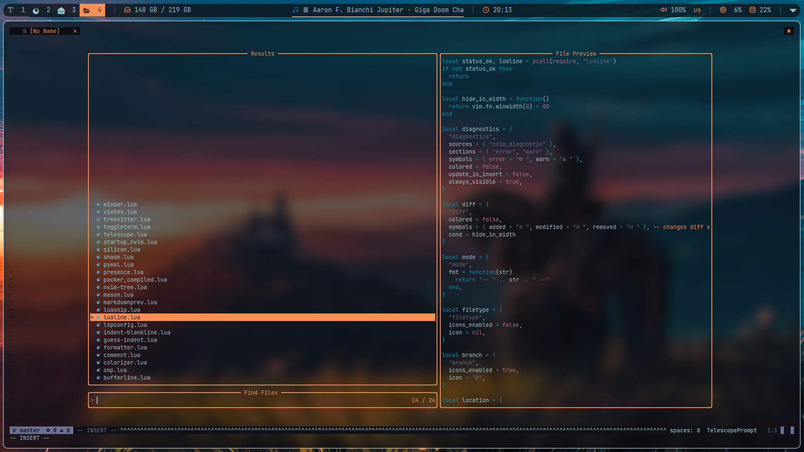
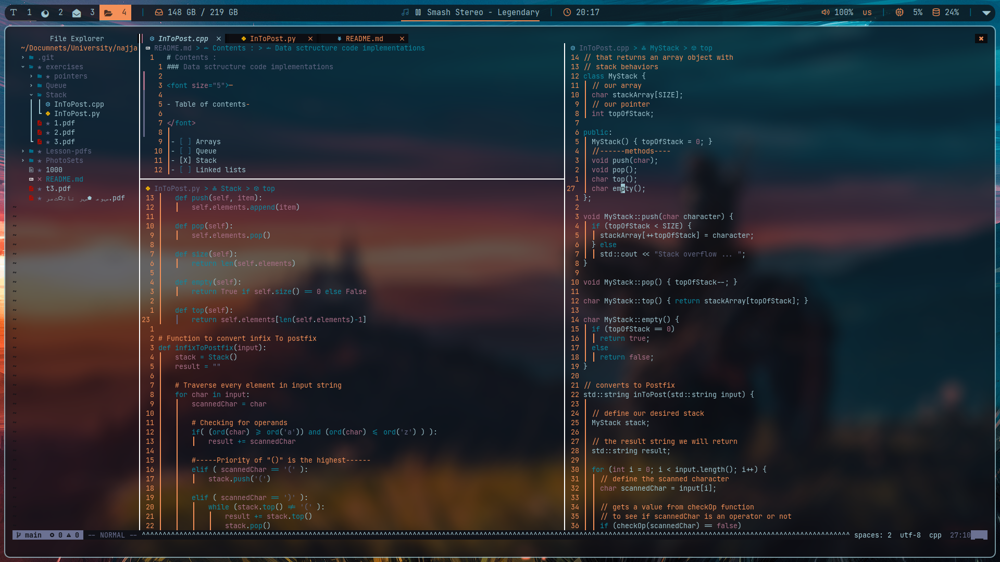
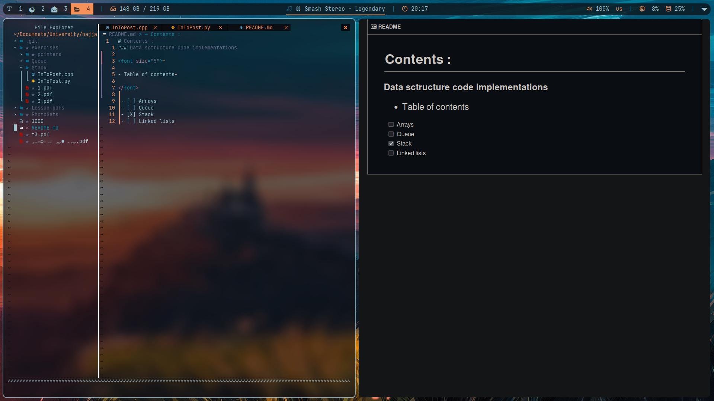
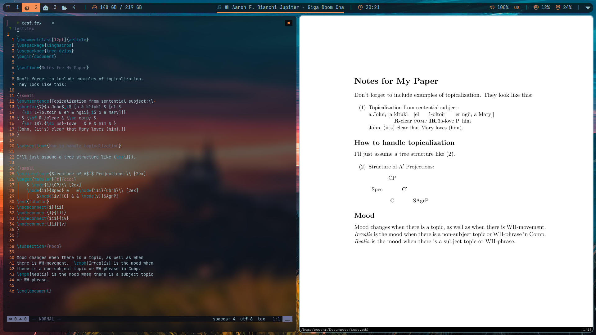

# 
 Neovim config

 

This config is made to have a fast and fully functioning neovim ready to be used .

## Showcase

## Plugins

- pywal.nvim as color scheme
- toggleterm.nvim as built-in terminal
- bufferline.nvim for buffer management
- presence.nvim for discord status
- mason.nvim for language server management
- lualine.nvim for the bottom status line
- markdown-preview.nvim for previewing markdown(.md) files
- vimtex for LaTeX(.tex) files
  - uses zathura for the pdf preview
- nvim-tree.lua as file explorer
- winbar.nvim shows the location of your cursor and the scoping
- silicon.lua for taking screen shots or code snaps
- telescope.nvim as the fuzzy finder

